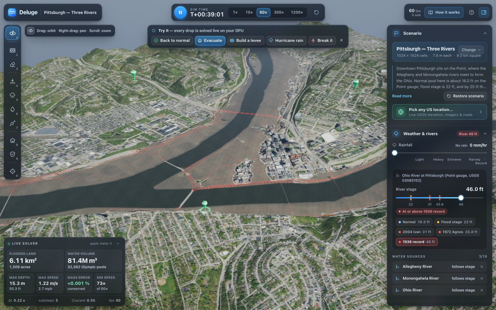
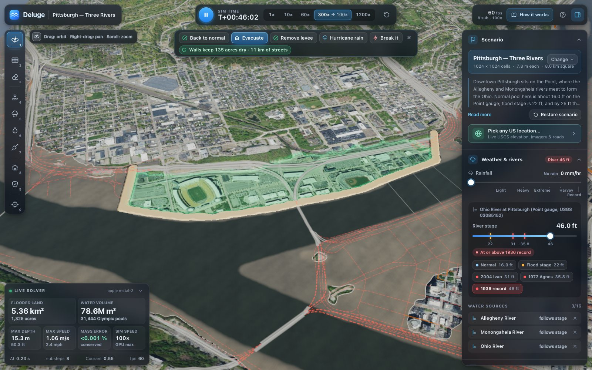

# Deluge — real-time flood simulation on real terrain



Deluge loads real USGS elevation data for a place in the US and solves the 2-D shallow-water equations on the GPU with
WebGPU compute shaders, live in a browser tab. Raise the rivers to the 1936 crest, build a levee and see the land it
keeps dry, crank the rain, and watch an evacuation route re-plan as roads go under.

Built for SteelHacks, *No Wrapper* track: no language models anywhere in the product. How it works in depth:
[ARCHITECTURE.md](ARCHITECTURE.md). Module contracts: [src/contracts.ts](src/contracts.ts).

## Run it — three ways

Needs Node 20.19+ or 22.12+. The two browser paths need a WebGPU browser: Chrome, Edge or Brave 113+, Safari 26+
(Safari 18 has WebGPU behind *Develop → Feature Flags*), or Firefox 141+ on Windows / 147+ on Apple-silicon Macs. All
four built-in scenarios run with no network at all; only live areas and the location picker use the internet.

```bash
npm ci                        # the only step that needs the network
```

**1 · Dev server** — hot reload and `window.__deluge` in the console:

```bash
npm run dev                   # http://localhost:5173
```

**2 · `npm run demo`** — the production build, served locally. This is the offline demo path:

```bash
npm run demo                  # builds, then serves http://localhost:4173
npm run demo -- --port 5000   # if 4173 is busy
```

**3 · `Deluge.app`** — a macOS desktop build, for presenting without a terminal or a browser on screen:

```bash
npm run app:build             # typecheck, build, package → release/Deluge.app (ad-hoc signed, ~330 MB)
open release/Deluge.app
npm run app:dev               # the wrapper on the current build, without packaging
```

The wrapper (`electron/`) is an Electron main process with no preload, no IPC, no Node in the renderer and no
listening port. It serves the same static build over a privileged `app://deluge/` origin, sends the CSP —
`frame-ancestors 'none'` included, which a hosted copy cannot — as real response headers, allows network requests
only to the seven data endpoints, denies every permission the page could ask for, and holds the display awake from
the main process, so the venue screen cannot sleep mid-pitch even on a Mac whose browser has no Wake Lock API.
`npm run app:check` is its release gate; the app is not committed (`release/` is ignored), so build it on the
machine that will present.

In a browser, Deluge asks for a **Screen Wake Lock** instead, which holds the display awake in Chrome and Brave with
nothing to switch on. Safari has no such API — see [DEMO.md](DEMO.md) for the `caffeinate -dis` fallback.

Presenting to judges? [DEMO.md](DEMO.md) has the pre-demo checklist, pitch scripts and a Q&A crib sheet.

`npm run build` writes a static site to `dist/` with relative URLs, so any static host works, including under a
sub-path (`.github/workflows/pages.yml` publishes it to GitHub Pages once the repository is public and Pages is set to
"GitHub Actions"). A hosted copy still needs WebGPU; keep `npm run demo` as the offline path.

URL options: `?preset=pittsburgh|johnstown|ellicott|sandbox`, or any US area with `?live=<lat>,<lon>,<km>`
(e.g. `?live=29.95,-90.07,6` for New Orleans; this needs the internet for USGS, Esri and Census TIGERweb).

## Try this (30 seconds)

1. Pittsburgh loads with full rivers. Click **Raise to 1936 record** in the *Try it* strip. The rivers rise to 46 ft
   along their whole length over a few simulated minutes (a time-lapse: the real 1936 rise took ~30 hours), and the
   Point, the North Shore and the Strip District go under.
2. Click **Evacuate** (or press **8** and click a street): the route to the nearest dry shelter re-plans, or turns red,
   as roads flood.
3. Click **Build a levee**: a floodwall goes up along the North Shore and the 1936 rise replays with it in place. The
   land it keeps dry turns green and the strip counts it (about 139 acres and 11 km of streets at the crest), while
   the evacuation route re-plans as the water comes back. Or press **2** and drag your own wall, tying both ends into
   high ground; press **V** to step through Depth / Max depth / Speed (or scroll the side panel to View).
4. **Break it** (Try-it strip or How it works) swaps in a textbook explicit solver and drops one small splash mid-view;
   it blows up within seconds. **Restore** recovers.



On a live area with no river crossing the map edge (picked with *Pick any US location*), the first button drops a
thunderstorm over the view instead.

Keys: `1`–`0` tools, `Space` pause, `R` reset water, `V` next water view, `?` help. **On a laptop,** plug in: the app
adapts solver substeps and render resolution to measured frame time and GPU latency, and detects browser 30 fps caps on
battery, but 60 fps needs mains power. On an Apple M4 the 1936 crest flood with extreme rain runs at 60 fps (p95 frame 19 ms) and
~70× real time at 1600×1000 (numbers and the MacBook Air expectation: [ARCHITECTURE.md §8.1](ARCHITECTURE.md#81-performance-budget-measured)).

## Why this is hard

An explicit shallow-water solver on real terrain wants to explode: rivers are deep and fast, floodplains are
centimetre-thin films, walls and streets are one cell wide, and everything runs in Float32 on a GPU in parallel.
Four ingredients keep Deluge stable, exact and fast (details in [ARCHITECTURE.md §3](ARCHITECTURE.md#3-numerical-method)):

1. **CFL-adaptive timestep with the 2-D Courant number** `dt = Cr·dx / (√2·max(√(g·h) + |u|))`, from asynchronous
   readbacks inflated by what is known to be coming. A wave never jumps more than a cell.
2. **Semi-implicit friction:** dividing instead of subtracting, so friction on thin films can only slow water down.
3. **Positivity-preserving flux limiter:** a cell can't give away more water than it holds, so depth stays ≥ 0 without
   clamping. A per-cell ledger books every change to the water — even the GPU's own Float32 rounding — so the HUD's
   mass-balance error stays ≈ 10⁻⁷ after hours of a crest with hurricane rain.
4. **Well-balanced face depths:** a lake at rest on steep, rough terrain stays at rest.

On top of that: minmod-limited θ-smoothing that damps grid-scale noise but not flow along staircase banks, open
boundaries that let rivers leave at their own depth, water-level boundaries that hold no momentum, and a river stage
that rises in simulated time instead of dam-breaking along every bank.

### Validation

From `npm test` (the solver tests run on a real GPU through Dawn):

| Check | Result |
| --- | --- |
| Lake at rest on rough terrain, 2000 steps ([wellbalanced](tests/sim/wellbalanced.test.ts)) | max \|u\| = 9.3·10⁻⁵ m/s |
| Dam break vs the Ritter analytic solution ([dambreak](tests/sim/dambreak.test.ts)) | profile error 1.6 % (L1) |
| Closed domain mass conservation ([conservation](tests/sim/conservation.test.ts)) | mass error 7·10⁻⁹ (volume change 2.5·10⁻⁶, all booked rounding) |
| Open domain with rain, storms, inflow, stage, infiltration ([conservation](tests/sim/conservation.test.ts)) | mass error ≤ 9.1·10⁻⁸ |
| Deep river with rain and a stage boundary, 3 sim-hours ([conservation](tests/sim/conservation.test.ts)) | mass error 5.9·10⁻⁷ |
| Rain on a tilted plane at steady state ([boundary](tests/sim/boundary.test.ts)) | outflow / rain = 1.000 |
| Channels at 0–60° to the grid ([channel](tests/sim/channel.test.ts)) | depth within 6 % of Manning's normal depth (0.98–1.05) |
| GPU (Float32, parallel) vs Float64 CPU reference, 5 cases × 400 steps ([reference](tests/sim/reference.test.ts)) | max \|Δh\| ≤ 4.3·10⁻⁵ m |

In the running app the HUD's mass-balance error stays below 0.001 % at the 1936 crest, with or without hurricane rain.

**Checked against the National Weather Service.** NWS impact statements for the Point gauge (PTTP1), against Deluge
holding each stage for 15 simulated minutes:

| NWS impact | NWS stage | Deluge |
| --- | --- | --- |
| Point State Park flooded to the Portal Bridge | 30 ft | dry at 30 ft, wet at 31 ft |
| PNC Park field flooded | 31 ft | dry at 31 ft, 1 m deep at 35 ft |
| Federal Street at PNC Park flooded | 40 ft | dry at 36 ft, wet at 40 ft |
| Up to 15 ft of water in the Golden Triangle | 46 ft | 15.7 ft at Point State Park |
| Acrisure Stadium field; Station Square tracks | 30 ft; 31 ft | first wet at 40 ft (both) |
| Wood Street T station; Parkway "bathtub"; Fort Pitt Blvd | 28; 25; 28 ft | wet only at 46 ft; dry at 46 ft; dry at 46 ft |

The water surface at the Point stays within 3 cm of the gauge reading at every stage. River-level and open-ground
impacts match within a few feet; the misses flood through what bare-earth elevation doesn't contain (storm drains,
underpasses, depressed roadways, underground stations). Full table: [ARCHITECTURE.md §4](ARCHITECTURE.md#4-rivers-stages-and-crests).

## How a frame works

```
solver.step ─▶ N substeps in one compute pass:  momentum pass ─▶ continuity pass   (CFL dt each)
renderer    ─▶ (every other frame) export pass (h, u, v, max depth) + prep ──▶ MSAA HDR → ACES
every ~300 ms, never blocking: stats reduction pass ─▶ mapAsync ─▶ HUD + road flood status ─▶ evacuation route
```

| Module | |
| --- | --- |
| [`src/sim`](src/sim) | GPU solver (WGSL in `shaders/`), forcing, brush edits, Float64 CPU reference |
| [`src/render`](src/render) | terrain LOD, water, hazard maps, walls, roads/route ribbons, camera, picking |
| [`src/data`](src/data) | USGS 3DEP / imagery / roads loaders, hydro-conditioning, presets, live areas |
| [`src/routing`](src/routing) | road graph, flood status per edge, travel-time Dijkstra |
| [`src/ui`](src/ui) | panels, tools, HUD, How it works, location picker |
| [`src/app`](src/app) | scene loading, store → solver sync, stage ramp, protected-land analysis, frame pacing, screen wake lock, debug API (`window.__deluge`, dev and flagged builds only) |

## Repo tour

* `src/<module>/` — the app, one folder per module, integrated through [`src/contracts.ts`](src/contracts.ts).
* `tests/<module>/` — `node:test` suites (sim and render on a real GPU through Dawn).
* `scripts/bake-presets.ts` — bakes `public/presets/*` (raw downloads cached in `artifacts/bake-cache`);
  `scripts/e2e.mjs` — end-to-end demo flows in headless Chromium on the real GPU; `scripts/bench.mjs` — the
  performance benchmark (`npm run demo`, then `npm run bench -- --scenario=pgh`); `scripts/shot.mjs` — screenshots.
* Dev harnesses (run `npm run dev`, then open): `dev/render.html` (the renderer on a synthetic valley with analytic
  mock water, or `?preset=<id>` with the real solver), `dev/sim.html` (solver), `dev/data.html` (data loaders),
  `dev/ui.html` (UI on a fake store), `tests/routing/harness.html` (routing).

## Testing

Deluge ships six test layers. The first two are pure CPU and run anywhere; the rest drive a real GPU through
headless Chromium (or a real Electron build) and want a machine with WebGPU — the demo MacBook Air.

| Command | What it guards | Time |
| --- | --- | --- |
| `npm run typecheck` | TypeScript, no emit | ~5 s |
| `npm test` | 320+ unit tests (solver, data, routing, UI, render helpers) | ~45 s |
| `npm run e2e` | End-to-end app flows in a real browser (`-- --prod` for the built bundle) | ~3 min |
| `npm run test:perf` | **No lag** — fps, frame times, sim speed, input latency, drift | ~10 min |
| `npm run test:visual` | **No graphics glitches** — golden images + baseline-free detectors | ~20 min |
| `npm run test:security` | **No security regressions** — the penetration test's cases, automated | ~8 min |
| `npm run app:check` | **The desktop build** — 43 checks against a packaged, fused `Deluge.app` | ~12 min |

On a machine that has never run them, install the browser once with `npx playwright install chromium` (Playwright
itself is already a devDependency; the suites need its bundled Chromium for WebGPU). `npm run test:unit` is the
subset of `npm test` that needs no GPU; `npm run test:all` is everything at full length.

Each of the three suites builds its own production bundle, serves it on its own port (5701/5702/5703), writes a JSON
report under `artifacts/`, prints a table and exits non-zero on a regression. All take `--quick` for a fast subset,
and `--url=<url>` to measure an already-running or hosted copy instead. `npm run test:suites` runs all three in quick
mode and is the recommended pre-demo gate.

Those times assume a quiet machine on AC power with Low Power Mode off. Everything here is GPU work: with Low Power
Mode on, a background Spotlight reindex, or another browser open, the same runs take two to three times longer — and
the perf numbers stop meaning anything (see below).

```sh
npm run test:suites                     # fast gate, all three
npm run test:perf -- --quick            # one suite, fast
npm run test:visual -- --scene=breakit  # one scene
npm run test:security -- --case=CAP     # one group of cases
```

### `npm run test:perf` — the lag suite

Six scenarios (idle Pittsburgh, crest raise, crest + 100 mm/hr rain at 300×, Johnstown inflow, a levee built with
real pointer drags, and a live-area load that is skipped when offline) at both the demo viewport (1470×956 @ DPR 2)
and 1600×1000 @ DPR 1. Per scenario it asserts mean and p95-low fps, frame-time p50/p95/p99, the count of frames over
34 ms and 50 ms, achieved sim speed (absolute and as a fraction of what was asked), main-thread CPU ms per frame, GPU
queue latency, input latency (a real pointer drag, measured to the first frame that shows the new camera),
time-to-interactive, and — once — a 60-second sustain run checked for drift.

Thresholds come in two tiers. **Floors** are "the demo is visibly broken" and are always fatal. **Targets** are what
this machine actually measures today plus headroom; they are fatal on a quiet machine and advisory when the run is
noisy. Every threshold is overridable: `DELUGE_PERF_MIN_FPS=50 npm run test:perf`.

The suite records `pmset` power state with every run. **Low Power Mode changes the answer**: on the demo Air the same
scenario measured 162× sim speed with it off and 27× with it on. A run with Low Power Mode on is therefore never
fatal — it prints a banner telling you to turn it off and re-run. Plug in and turn Low Power Mode off before
believing any number here.

### `npm run test:visual` — the graphics-glitch suite

Fifteen scenes are frozen into an exactly reproducible state through `window.__deluge` — sim paused, advanced by an
exact number of simulated seconds with `runFor`, camera pose assigned rather than animated, and the adaptive quality
ladder pinned so render scale cannot drift — then captured at 1470×956 @ DPR 2. Scenes cover the default Pittsburgh
view, the 1936 crest, the demo levee with its protected-land glow, all three hazard modes, the Break-it stability
demo, each other preset's own camera, a close-up shoreline, a drawn wall, a bridge, top-down and a low grazing angle.

Two independent checks:

- **Golden images.** Each scene is compared with its committed baseline in `tests/visual/baselines/` using a
  perceptual (YIQ-weighted) diff; the tolerance is the fraction of pixels allowed to differ. When a rendering change
  is intentional, look at the diffs in `artifacts/visual/diff/`, then re-record with `node scripts/visual.mjs
  --update` and commit the updated PNGs.
- **Detectors that need no baseline** — the real regression net, because a stale baseline happily approves a glitch:
  black or blank frames, NaN-magenta pixels outside Break-it (and their *absence* inside it), water standing
  unsupported above terrain (a hydrostatic check against the solver's own arrays), shoreline stair-stepping,
  z-fighting flicker (repeat captures of a frozen scene must be identical), missing aerial imagery, UI panels running
  off the canvas edges, and legend-vs-pixels colour agreement — the water mask is obtained by re-rendering the same
  frozen scene in another hazard mode, so the check needs no tuned colour threshold and fails if a mode is ever wired
  to the wrong ramp.

### `npm run test:security` — the security regression suite

This one builds the **released** bundle — a plain `vite build`, with no debug API — and drives it through the DOM
only, because one of the things it checks is that `window.__deluge` is not there. Every third-party host is
intercepted, so the run is hermetic and behaves identically offline.

It automates the findings of this project's own penetration test: link-parameter spoofing through `?name=`,
`?preset=` and an invalid `?live=` (the attacker's sentence must never appear in the app's chrome, and no bidi
control character may reach the DOM); XSS through hostile Nominatim results, preset metadata and road data
(`window.__pwned` must stay unset); the Content-Security-Policy present in the built `index.html`, restrictive, ahead
of the first script tag, and raising zero violations across the main flows; response byte caps refusing an oversized
body, a forged `Content-Length` and a gzip bomb without exhausting memory; no source maps, build-machine paths or
debug surfaces in `dist/`; and a clean `npm audit --omit=dev`. A case whose fix has not landed, or that could not be
exercised in this build, is reported **PENDING** rather than passing silently; `--strict` makes pending fatal.

### `npm run app:check` — the desktop build's release gate

`electron/verify-renderer.mjs` then `electron/verify-packaged.mjs`: 43 checks (23 + 20) over the wrapper's rules — no Node,
bridge or IPC in the renderer, the `app://deluge` origin and a real WebGPU adapter, the CSP on every response,
path-traversal attempts refused, navigation and new windows blocked, the network allowlist proven independently of
CSP, every permission denied, a self-signed data host rejected, the R11 fuse wire, a tampered `app.asar` refusing to
start, no listening socket, no DevTools, no debug API in the packaged asar, and the display-sleep blocker running.
The packaged, fused app cannot be driven from outside (that is two of the checks), so it reports on itself through a
hook that `electron/package.mjs` stages **only** into the differently-named verification bundle; the shipped
`Deluge.app` does not contain that code at all.

**Driving the app from automation.** The e2e flows, `scripts/bench.mjs` and `scripts/shot.mjs --ready=…` all steer the
app through `window.__deluge`, which a released build no longer contains: it is compiled out unless the build sets
`DELUGE_DEBUG_API=1` (`vite.config.ts`, `src/env.d.ts`), so a copy handed to anyone else exposes no automation surface.
`npm run dev` keeps it, and `npm run e2e` sets the variable before it builds, so neither needs anything. A server you
start yourself for those tools needs it too:

```bash
DELUGE_DEBUG_API=1 npm run demo   # same as npm run demo, plus window.__deluge for bench / shot
```

Routing timing bounds are asserted in `tests/routing/perf.test.ts` (normalised for machine load); `PERF=1` also checks
them in the real-data Pittsburgh test.

## Security

No accounts, no backend, no analytics and nothing stored: the app is static files plus the seven public data
endpoints it fetches terrain, imagery, roads and place names from. A released build contains no automation surface
(`window.__deluge` is compiled out), and its Content-Security-Policy is `default-src 'none'` with `script-src 'self'`
— no `unsafe-inline`, no `unsafe-eval` — restricting `connect-src` to exactly those seven endpoints
([`src/data/csp.ts`](src/data/csp.ts) is the single source of truth, mirrored into the desktop wrapper and guarded by
a test that fails if a new host appears). `npm run test:security` re-runs this project's own penetration-test cases
against the built bundle.

**Accepted risk, stated on purpose:** a copy hosted on GitHub Pages can be framed by any other origin. Pages cannot
send a `Content-Security-Policy` header and `frame-ancestors` is ignored in a `<meta>` tag, so there is no way to
forbid it from a static host. The impact is limited to what a framed copy could do: there is nothing to click-jack
into — no accounts, no state-changing requests, nothing persisted — so the worst case is a misleading presentation of
a simulation. `Deluge.app` serves the same build with `frame-ancestors 'none'` as a real header
([ARCHITECTURE.md §10](ARCHITECTURE.md#10-shipping-browser-desktop-app-and-the-test-suites)).

## Known limitations

* **Hydro-flattened elevation.** 3DEP has no river bathymetry, so channels are burned to a nominal depth (6 m for
  Pittsburgh's rivers); river volumes and speeds are approximate.
* **Bare-earth terrain.** Buildings, bridge decks and culverts are not in the DEM; water flows through blocks and under
  viaducts, and storm drains are not modelled. Road and highway embankments therefore dam small creeks: under heavy
  rain water ponds several metres deep behind them (8.5 m behind I-376 in Pittsburgh's Saw Mill Run valley at
  100 mm/hr; up to 14 m in a pit beside US 40 after an hour of Ellicott City's storm), which also sets the HUD's max
  depth.
* **Uniform roughness.** One Manning's n for the whole map (0.035, adjustable under Advanced); no land-cover roughness
  map.
* **Protected land is a still-water estimate.** The green "kept dry" land and its acres compare the water level held
  back by the walls with and without them; they ignore how long water leaking through a gap would take to fill the
  land behind it.
* **Time-lapse rise.** Raising the river is ~600–850× faster than the 1936 rise; the flood that follows is solved at
  its real speed.
* **Scheme.** Local-inertial with first-order upwind advection: excellent for floodplain inundation, less so for
  strongly supercritical flow (hydraulic jumps, violent dam breaks).
* **Boundaries.** River stages are imposed where rivers cross the domain edge, with a small head that keeps the
  rivers flowing downstream; discharges at the 1936 crest are lower than the historic record.
* **Coverage.** Live areas are US-only at full quality (USGS 3DEP); elsewhere the coarse Terrarium fallback is used.

## Data and attribution

Baked presets use only public-domain U.S. government data (details in
[public/presets/SOURCES.txt](public/presets/SOURCES.txt)):

* Elevation: **USGS 3D Elevation Program (3DEP)**
* Imagery: **USDA NAIP** via USGS The National Map
* Roads: **U.S. Census Bureau TIGER/Line**
* Flood stages and historic crests: NOAA National Weather Service (gauge PTTP1) and USGS peak-flow records

Live areas and the location picker's basemap fetch **Esri World Imagery** at runtime (© Esri, Vantor, Earthstar
Geographics, and the GIS User Community; Esri's terms apply). Fallbacks: **Mapzen Terrarium** elevation tiles (AWS Open
Data) and **OpenStreetMap** roads (© OpenStreetMap contributors, ODbL). Place search and names: OpenStreetMap
Nominatim.

Method: Bates, Horritt & Fewtrell (2010), *J. Hydrology*; de Almeida, Bates, Freer & Souvignet (2012), *Water
Resources Research*.

## License

Code: MIT (see [LICENSE](LICENSE)). Data: see *Data and attribution* above.
